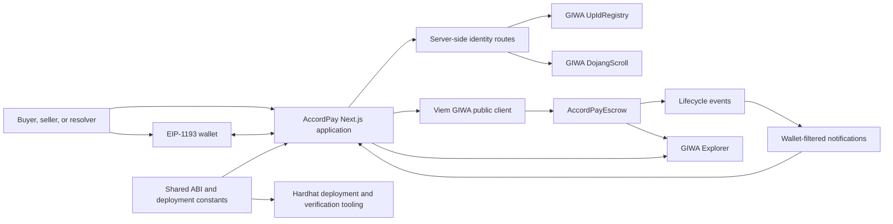
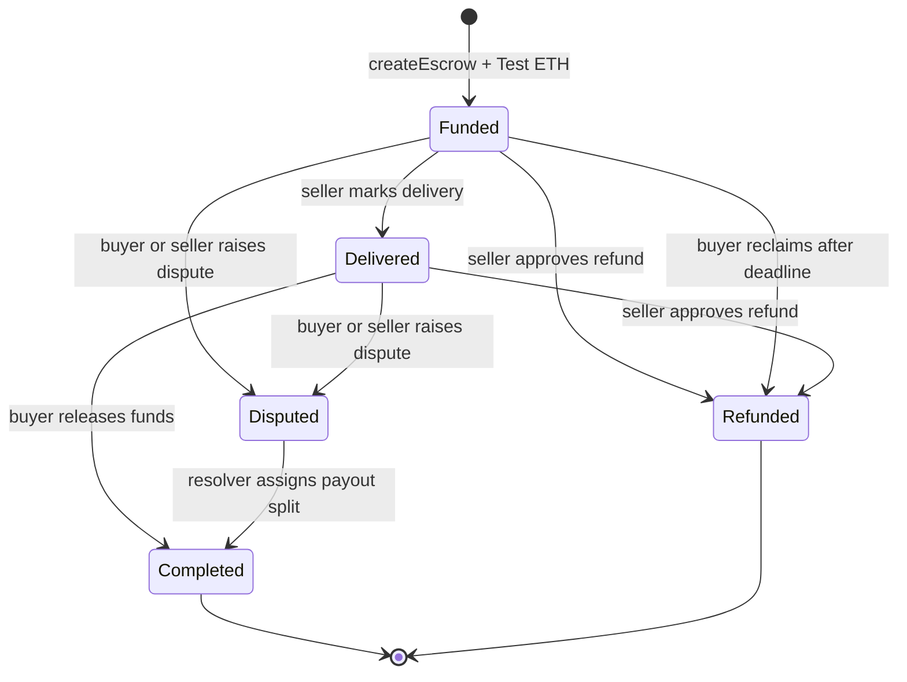
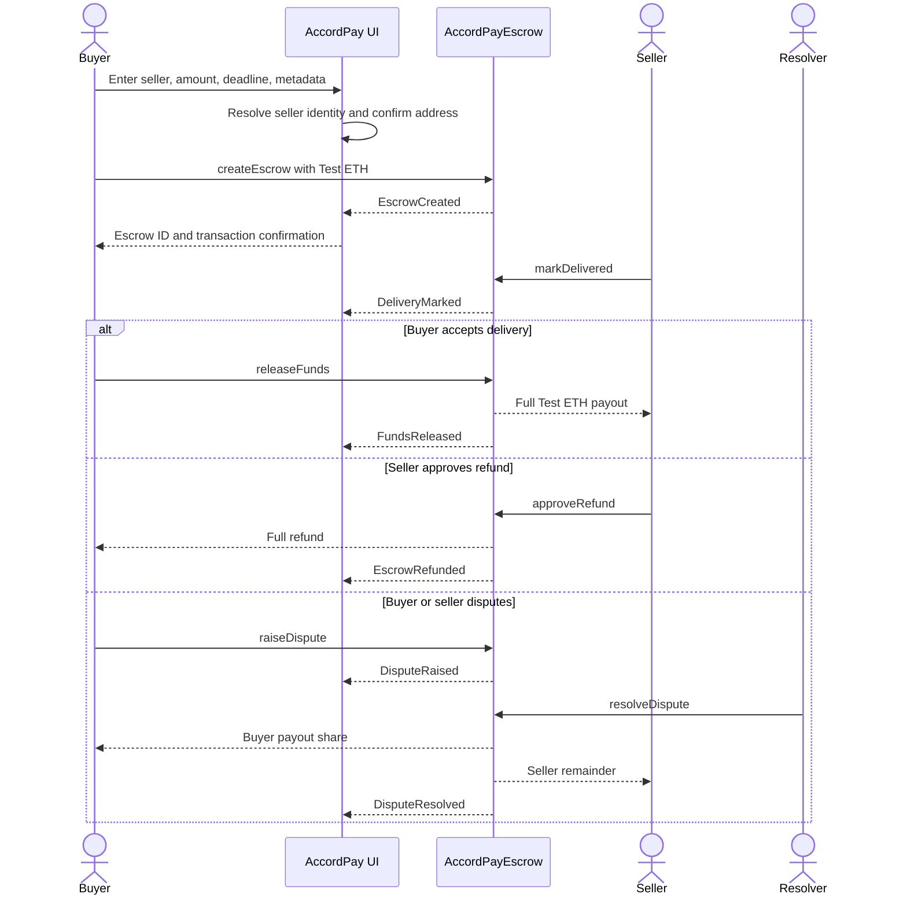

# AccordPay Technical Design

## Executive summary

AccordPay is verified escrow and programmable commerce infrastructure built on GIWA. The current MVP lets a buyer create and atomically fund a native Test ETH escrow, lets the seller record delivery, and lets the buyer release payment. It also supports seller-approved refunds, buyer deadline reclaim before delivery, and designated-resolver dispute settlement.

The application combines a Next.js frontend, a non-upgradeable Solidity contract, wallet-based identity, GIWA Upbit Web3 Name resolution, on-chain Dojang Verified Address checks, and contract-event notifications. It is deployed only for GIWA Sepolia testnet use. Test ETH has no monetary value, and the contract has not been independently audited.

## Problem AccordPay solves

Digital commerce between unfamiliar parties creates a timing problem: buyers do not want to pay before acceptable delivery, while sellers do not want to deliver without funded payment. Informal coordination, direct transfers, and manual escrow can leave transaction state unclear or make the workflow expensive to integrate.

AccordPay gives both parties one inspectable agreement state, explicit role permissions, and an on-chain settlement path. The product presents contract state in plain language while keeping wallet confirmation and transaction evidence visible.

## Product users

- **Buyers** that want funds held until delivery is recorded.
- **Sellers** that want proof that an agreement is funded before delivery.
- **Freelancers** coordinating service delivery and payment with clients.
- **Founders** purchasing remote services or integrating escrow into early products.
- **Developers** that need a tested escrow primitive and event-driven frontend model.
- **Merchants** exploring programmable settlement for digital commerce.

These are intended user groups, not adoption or transaction-volume claims.

## GIWA integration

| Property               | Value                                                                                                                   |
| ---------------------- | ----------------------------------------------------------------------------------------------------------------------- |
| Network                | GIWA Sepolia                                                                                                            |
| Chain ID               | `91342`                                                                                                                 |
| Native asset           | Test ETH                                                                                                                |
| Public RPC             | `https://sepolia-rpc.giwa.io`                                                                                           |
| Explorer               | `https://sepolia-explorer.giwa.io`                                                                                      |
| AccordPayEscrow        | `0x0d6e2c12BD5916B1020A03f30EAf3b73f09dF798`                                                                            |
| Deployment block       | `31913078`                                                                                                              |
| Verified explorer page | [AccordPayEscrow on GIWA Explorer](https://sepolia-explorer.giwa.io/address/0x0d6e2c12BD5916B1020A03f30EAf3b73f09dF798) |

AccordPay is an independent product built on GIWA. The public GIWA RPC may be rate-limited and should be replaced or supplemented with suitable infrastructure before production use.

## Architecture overview



The repository is an npm workspace:

- `apps/web` — Next.js application.
- `packages/contracts` — Hardhat, Solidity contract, tests, and scripts.
- `packages/shared` — exported contract ABI and deployment constants.
- `docs` — product, UX, security, deployment, and submission documentation.

## Frontend architecture

The frontend uses Next.js with TypeScript and the App Router. Reusable code is separated by responsibility:

- `src/app` defines public, application, API, and private review routes.
- `src/components/ui` contains accessible design-system primitives.
- `src/components/app-shell` contains responsive navigation, identity controls, and notifications.
- `src/features/escrow` contains contract reads, lifecycle presentation, form preparation, and writes.
- `src/hooks` coordinates queries for names, Dojang status, transactions, and notifications.
- `src/services` isolates server and browser adapters.
- `src/config` contains GIWA and deployed-contract configuration.

TanStack Query handles cached asynchronous reads. CSS modules and the approved AccordPay tokens provide responsive styling without a large component framework.

## Smart-contract architecture

`AccordPayEscrow` is a non-upgradeable native-asset escrow. One record contains one buyer, one seller, one Test ETH deposit, a deadline, lifecycle state, metadata references, and timestamps.

The contract uses:

- OpenZeppelin `Ownable2Step`.
- OpenZeppelin `Pausable`.
- OpenZeppelin `ReentrancyGuard`.
- Explicit role and state validation.
- Checks-effects-interactions before payouts.
- Aggregate `totalEscrowLiability` accounting.
- Events for frontend indexing.

There is no owner withdrawal, seizure, sweep, proxy, upgrade hook, hidden fee, or unbounded escrow loop.

## Wallet connection architecture

Wagmi and Viem provide wallet and chain integration. Browser wallets are discovered through EIP-6963 announcements so that AccordPay does not treat one generic injected provider as multiple installed wallets.

The wallet selector:

- Opens only after a user action.
- Connects only the selected announced provider.
- Avoids automatic `eth_requestAccounts` calls.
- Shows a wallet-specific pending or rejection state.
- Detects GIWA Sepolia and offers network switching.

The connected wallet is the MVP identity mechanism. AccordPay does not provide email accounts, passwords, custodial balances, or user profiles.

## UP ID identity resolution

Upbit Web3 Names remain secondary identity context; the wallet address is canonical.

Server-side resolution uses the GIWA Sepolia UpIdRegistry at:

```text
0x091D00004f21eb2Fc30964A8a4995692d9b49628
```

Forward resolution:

1. Normalize `username.up.id`.
2. Compute the ENS label hash.
3. Read registry ownership.
4. When configured, cross-check the Ethereum Sepolia ENS forward record.

Reverse resolution:

1. Confirm `hasActiveName(wallet)`.
2. Read `ownedTokenId(wallet)`.
3. Read the label and reconstruct `username.up.id`.
4. Confirm `ownerOf(tokenId)` still equals the wallet.
5. Perform the matching forward check.

Only matching forward and reverse ownership produces **Name confirmed**. No-name, mismatch, and resolver-unavailable states do not replace the canonical address. Confirmed entries use a short cache TTL; unresolved entries are not permanently cached.

## Dojang Verified Address integration

Dojang verification is a separate on-chain query. It does not depend on UP ID resolution.

The server reads the GIWA Sepolia DojangScroll contract:

```text
0xd5077b67dcb56caC8b270C7788FC3E6ee03F17B9
```

using:

```solidity
isVerified(address addr, bytes32 attesterId)
    external
    view
    returns (bool)
```

The testnet policy checks the documented UPBIT KOREA and TESTNET FAUCET attester IDs. A successful `false` is displayed as **Dojang not verified**. RPC or contract-query failure is displayed as **Verification unavailable**.

## Notification event system

The notification panel reads confirmed `AccordPayEscrow` logs from deployment block `31913078` to the latest GIWA Sepolia block and filters them for the connected buyer or seller.

| Contract event    | Notification       |
| ----------------- | ------------------ |
| `EscrowCreated`   | Escrow funded      |
| `DeliveryMarked`  | Delivery submitted |
| `FundsReleased`   | Funds released     |
| `EscrowRefunded`  | Refund completed   |
| `DisputeRaised`   | Dispute opened     |
| `DisputeResolved` | Dispute resolved   |

Every item retains its real escrow ID, block number, transaction hash, agreement route, and GIWA Explorer link. No sample notification is inserted into the live feed.

Read IDs are stored locally under a key containing chain ID and wallet address. This persistence affects presentation only; contract events remain the source of truth.

## Escrow lifecycle



- **Funded** — creation and funding succeeded atomically.
- **Delivered** — the seller recorded delivery and an evidence reference.
- **Completed** — the buyer released funds or the resolver completed a dispute payout.
- **Refunded** — the deposit returned to the buyer through an allowed refund path.
- **Disputed** — ordinary settlement is frozen until the resolver acts.

There is no unfunded on-chain Created state and no unilateral buyer cancellation state.

## Buyer and seller interaction



## Buyer workflow

1. Connect a wallet and switch to GIWA Sepolia.
2. Enter a seller wallet or valid UP ID.
3. Confirm the resolved canonical seller address.
4. Enter Test ETH amount, future deadline, and public metadata URI.
5. Review the 0 ETH protocol fee and total deposit.
6. Sign `createEscrow`; creation and funding occur in one transaction.
7. Read the confirmed escrow ID from the receipt event.
8. After delivery, release funds, raise a dispute, or use deadline reclaim when contract conditions permit.

## Seller workflow

1. Connect the seller wallet.
2. Open the numeric escrow ID.
3. Confirm the on-chain buyer, amount, deadline, metadata, and Funded state.
4. Submit a public delivery-evidence URI through `markDelivered`.
5. If appropriate, approve a full refund while Funded or Delivered.
6. Raise a dispute from an eligible state when settlement cannot proceed.

## Resolver workflow

1. Connect the designated resolver wallet.
2. Open an escrow in Disputed state.
3. Enter the buyer share from 0 to 10,000 basis points.
4. Review the implied buyer and seller split.
5. Sign `resolveDispute`.
6. Confirm that the escrow becomes Completed and both payout amounts appear in `DisputeResolved`.

This is designated testnet resolution, not decentralized arbitration.

## Security controls

- Non-upgradeable contract with no proxy.
- Reentrancy protection on payout paths.
- Checks-effects-interactions.
- Strict buyer, seller, resolver, and owner permissions.
- Terminal-state enforcement against double release and refund.
- Positive deposit, non-zero seller, buyer/seller separation, and future-deadline validation.
- Metadata and delivery references limited to 2,048 bytes.
- Liability increases on funding and decreases once on terminal payout.
- Contract balance must cover active liability under reachable behavior.
- Direct `receive` and `fallback` transfers revert.
- Ownership transfer is two-step; renunciation is disabled.
- Pausing blocks new creation but not existing settlement and recovery paths.
- Owner cannot withdraw or redirect active escrow funds.

## Testing results

The current repository validation includes:

- **78 passing smart-contract tests** covering creation, delivery, release, refunds, disputes, administration, reentrancy, rejecting recipients, forced ETH, liability, and terminal states.
- **12 passing name and connected-identity tests** covering forward/reverse matching, fallback states, invalid names, and canonical-address submission.
- **5 passing Dojang tests** covering verified, not verified, malformed address, RPC failure, and independence from UP ID.
- **4 passing notification tests** covering open/close state, empty state, unread state, mark-all-read, and account/network key isolation.
- Successful Next.js production build, ESLint, TypeScript, and Prettier validation.

These automated checks are not an independent security audit.

## Contract limitations

- Test ETH only.
- One buyer, one seller, and one payment per escrow.
- No milestone or partial voluntary release.
- Designated resolver rather than full arbitration governance.
- Direct payout recipients can reject ETH and block a selected payout path.
- No on-chain list pagination; event indexing is required.
- Metadata availability, privacy, and moderation are outside the contract.
- Deadlines use block timestamps.
- Forced ETH cannot be prevented and is not recoverable through an owner sweep.
- No production multisig, monitoring, formal verification, or independent audit.

## Testnet and unaudited-contract disclosure

AccordPay currently operates on GIWA Sepolia. Test ETH has no monetary value. The deployed contract source is verified on GIWA Explorer, but source verification is not a security audit. `AccordPayEscrow` has not been independently audited and must not be represented as production-ready financial infrastructure.

## Deployment architecture

- The frontend is a Next.js application deployed at [accordpay-giwa.vercel.app](https://accordpay-giwa.vercel.app).
- Public application routes are rendered by Next.js.
- Server routes perform UP ID and Dojang reads without exposing secrets to the browser.
- Wagmi and Viem perform GIWA wallet, contract, receipt, and event operations.
- The ABI and immutable deployment facts are exported from `packages/shared`.
- Hardhat scripts compile, test, deploy, verify, and export the ABI.
- No private key or deployment signer is included in frontend artifacts.

## Revenue model

The MVP protocol fee is 0%, so the testnet application collects no escrow fee.

Potential future revenue, subject to product validation, legal review, and transparent pricing, includes:

- A disclosed fee on successfully settled escrows.
- Merchant or marketplace integration plans.
- Escrow API and developer infrastructure.
- Higher-volume operational tooling and support.

These are revenue opportunities, not current revenue or commercial commitments.

## Future roadmap

Potential post-MVP work includes:

- Stablecoin and ERC-20 settlement.
- Milestone escrow payments.
- Merchant escrow API and event webhooks.
- Marketplace and commerce modules.
- Improved metadata and evidence storage.
- In-app buyer and seller communication.
- Pull-payment evaluation for rejecting recipients.
- Stronger dispute-governance design.
- Production RPC, monitoring, multisig roles, legal review, and independent audit.

Every roadmap item requires separate implementation and validation; none should be inferred from the current contract.
