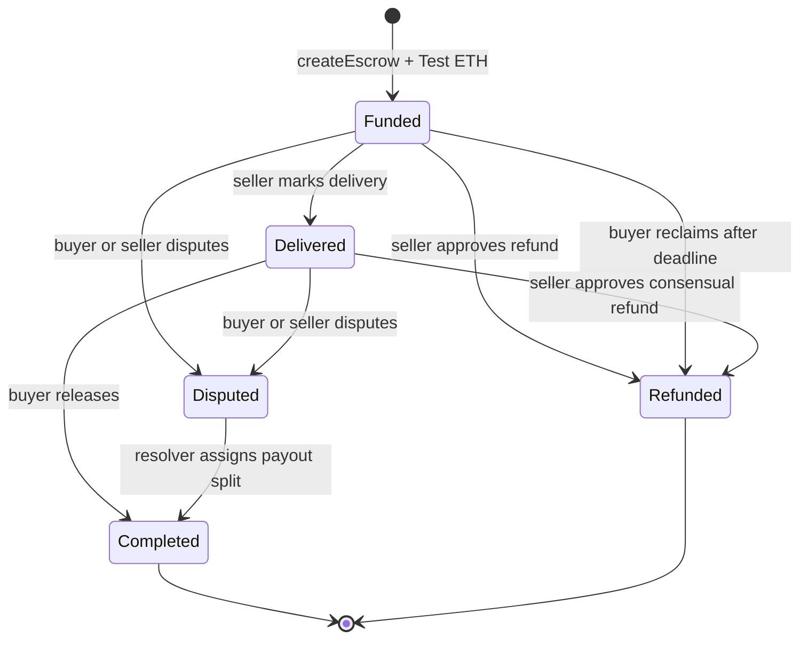

# AccordPay Smart-Contract Design

## Status and purpose

`AccordPayEscrow` is the non-upgradeable, native-asset escrow foundation for the AccordPay MVP on GIWA Sepolia. One record represents one buyer, one seller, and one Test ETH deposit. Creation and funding are atomic.

This is testnet development software. Test ETH has no monetary value. The contract has not been deployed, verified, or audited.

## Trust assumptions

- The buyer trusts the seller to mark genuine delivery and may release only after reviewing it.
- The seller trusts the buyer to release after accepted delivery.
- Either party may freeze an eligible agreement by raising a dispute.
- The designated resolver is trusted to choose the testnet payout split for disputed agreements.
- The owner is trusted to maintain the resolver and pause or resume new creation. Pausing cannot block existing escrow exits. Ownership uses a two-step transfer, and renunciation is disabled.
- OpenZeppelin primitives reduce implementation risk but do not make this AccordPay contract audited.
- Off-chain metadata availability and integrity depend on the selected content-addressed storage system and client-side validation.

The owner has no withdrawal, sweep, seizure, or emergency fund-transfer capability.

## State machine

There is no on-chain `Created` state: a successful payable creation is immediately `Funded`. There is no `Cancelled` state because a funded buyer cannot cancel unilaterally. A resolved dispute becomes `Completed`; the resolution event preserves the payout split.



`Completed` and `Refunded` are terminal. Dispute freezes ordinary release and refund paths until the resolver acts.

## Roles and permissions

| Role          | Permissions                                                                                                    |
| ------------- | -------------------------------------------------------------------------------------------------------------- |
| Buyer         | Create and fund; release a delivered escrow; reclaim a still-funded escrow after deadline; raise a dispute     |
| Seller        | Mark delivery; approve a full refund while Funded or Delivered; raise a dispute                                |
| Resolver      | Resolve a Disputed escrow using a 0–10,000 basis-point buyer share                                             |
| Owner         | Update resolver; pause/resume creation; initiate/cancel two-step ownership transfer; cannot renounce ownership |
| Pending owner | Accept ownership                                                                                               |

## Storage model

Each escrow stores its numeric ID, buyer, seller, exact deposit, deadline, status, metadata URI, delivery-evidence URI, and creation/delivery/completion timestamps. `metadataURI` was selected over a bare hash because a content-addressed URI carries both the addressing scheme and immutable content reference while remaining indexer-friendly. Agreement and delivery references are limited to 2,048 bytes.

Only references belong on-chain. Full descriptions, confidential terms, delivery notes, and evidence files remain off-chain. Clients should use content-addressed URIs and verify retrieved content. There is no function returning all escrows; indexers reconstruct lists from events.

`totalEscrowLiability` increases with each deposit and decreases exactly once before a terminal payout. `totalLiability()` exposes the aggregate for monitoring. Forced ETH changes the raw balance but not liability.

## Refunds and deadlines

- A seller may approve a full refund in `Funded` or `Delivered`. Allowing it after delivery supports a consensual unwind when delivery is defective or both parties agree not to settle.
- A buyer may reclaim only when the deadline has passed and status remains `Funded`.
- Marking delivery disables deadline reclaim. Funds then require buyer release, seller-approved refund, or dispute resolution.
- Every refund sets terminal state before attempting payment.

## Disputes

Buyer or seller may move a `Funded` or `Delivered` escrow to `Disputed`. Funds remain in the contract. Only the current resolver can distribute them. `buyerShareBps` ranges from 0 through 10,000; the seller receives the exact remainder, preventing rounding dust. Zero-value payout legs are skipped. This is designated testnet resolution, not decentralised arbitration.

## Pause behaviour

Pausing blocks only new escrow creation. Delivery, release, approved refund, deadline reclaim, dispute raising, and dispute resolution remain available. This prevents a compromised or unavailable owner from freezing already locked user funds. Unpausing restores creation.

## Events

- `EscrowCreated` — identifier, parties, amount, deadline, metadata URI
- `DeliveryMarked` — identifier, parties, timestamp, evidence URI
- `FundsReleased` — identifier, parties, full seller payout
- `EscrowRefunded` — identifier, parties, amount, and seller-approved or deadline reason
- `DisputeRaised` — identifier, parties, raising address
- `DisputeResolved` — identifier, parties, buyer payout, seller payout
- `ResolverUpdated` — prior and new resolver
- `ContractPaused` / `ContractUnpaused` — administrator responsible

OpenZeppelin ownership and pause events are emitted in addition to AccordPay’s explicit administrative events.

## Security controls

- OpenZeppelin `Ownable2Step`, `Pausable`, and `ReentrancyGuard`
- Custom errors and strict role/state validation
- Checks-effects-interactions before every payout
- Terminal statuses prevent double release or refund
- Exact native deposit and aggregate liability accounting with zero protocol fee
- Rejected zero addresses, self-dealing seller, zero value, expired deadlines, and empty or oversized metadata references
- Disabled ownership renunciation
- Rejected `receive` and `fallback`, so ordinary accidental ETH transfers fail
- No `tx.origin`, `delegatecall`, `selfdestruct`, proxy, upgrade hook, hidden fee, or unbounded escrow loop
- No administrative movement of escrowed funds

Forced ETH sent through another contract’s `selfdestruct` semantics cannot be prevented at the EVM level. It is not credited to an escrow and there is deliberately no sweep function, because a sweep could undermine the no-administrative-fund-movement guarantee.

## Direct payouts versus pull payments

The MVP uses guarded direct payouts for a compact user flow. State changes occur before external calls, reentrancy is blocked, and a failed recipient call reverts the whole transition. The tradeoff is that a contract wallet that rejects native ETH can block its release or refund path and may require dispute handling; a rejecting payout recipient can also block a resolver’s chosen split. A future pull-payment design could isolate recipients and permit later withdrawal, but would add balances, withdrawal state, and another required transaction. It should be considered before production.

## Protocol fee

The protocol fee is 0% for the MVP. The entire deposit goes to the seller on release, the buyer on refund, or the two parties under a resolver split. `FEE_RECIPIENT` is documented only as reserved future configuration and is not read by this contract or deployment script.

## Why no upgradeability

The MVP has no proxy or upgrade authority. This reduces administrative power, storage-layout risk, and hidden mutability. Fixes require a separately reviewed deployment and explicit migration strategy.

## Known limitations

- Test ETH only; no ERC-20 or stablecoin support.
- One payment and one buyer/seller pair per escrow; no milestones or partial voluntary releases.
- Central designated resolver for testnet disputes.
- Direct payout recipients can reject transfers.
- No on-chain list pagination; event indexing is required.
- No metadata storage, privacy, availability, or moderation service is included.
- Deadlines use block timestamps and normal validator timestamp tolerances apply.
- Creation pause does not delay existing financial actions.
- No production key management, multisig ownership, monitoring, formal verification, audit, or deployment has been completed.

## Environment and network

Copy `packages/contracts/.env.example` to a local `.env`. The example contains no secrets.

| Variable               | Purpose                                                   |
| ---------------------- | --------------------------------------------------------- |
| `GIWA_SEPOLIA_RPC_URL` | GIWA Sepolia RPC; the public endpoint may be rate-limited |
| `DEPLOYER_PRIVATE_KEY` | Deployment signer; never commit                           |
| `DISPUTE_RESOLVER`     | Non-zero designated resolver                              |
| `FEE_RECIPIENT`        | Reserved and unused in the 0% fee MVP                     |
| `CONTRACT_ADDRESS`     | Existing deployment used by manual verification           |

GIWA Sepolia uses chain ID `91342` and explorer `https://sepolia-explorer.giwa.io`. Production infrastructure requires a suitable RPC provider.

## Build, deploy, and verify

From the repository root:

```bash
npm install
npm run contracts:compile
npm run contracts:test
npm run contracts:typecheck
npm run contracts:coverage
```

For a local deployment, run a Hardhat node in one terminal and deploy from another:

```bash
npm run node --workspace=@accordpay/contracts
npm run deploy:local --workspace=@accordpay/contracts
```

After deliberate GIWA testnet deployment approval and environment configuration:

```bash
npm run deploy:giwa --workspace=@accordpay/contracts
```

Deployment prints facts but does not write frontend configuration or auto-verify. After a real deployment, set `CONTRACT_ADDRESS` and run:

```bash
npm run verify:giwa --workspace=@accordpay/contracts
```

No deployment or verification is part of this phase.
